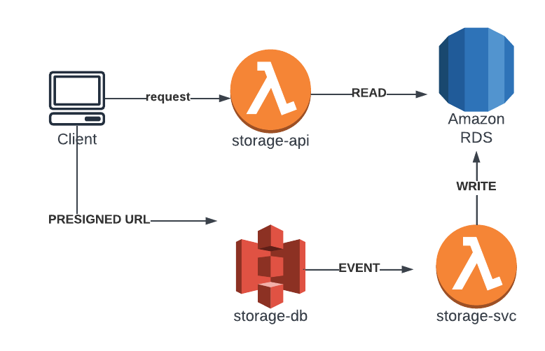

# storage-api

Development: Active

## Description

A web API responsible for generating presigned urls and transceiving files to S3. This API works with and without presigned urls to gain experience working with files.
Once a file has been created/updated/deleted from S3 than an event is emited and triggers the `storage-svc`. This lambda handles all non-safe database actions (create, update, delete).

## Getting Started

## Database structure

## Cloud Architecture

## Contributing

## Authors

- matttm : Matt Maloney : matttmaloney@gmail.com

## Issues

If you encounter an issue or a discrepency in the documentation, please message me or open an issue.

## License

This project is licensed under the MIT License - see the LICENSE.md file for details
